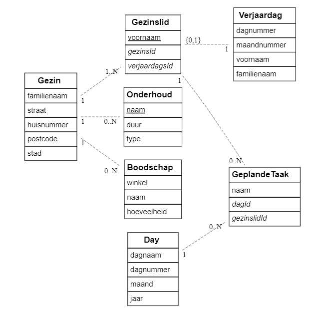

# Mikele Lemmens (202291269)

- [ ] Web Services: GITHUB URL
  - <https://github.com/Web-IV/2324-webservices-MikeleLemmens1.git>

**Logingegevens**

De onderstaande gegevens worden gebruikt om in te loggen als gezinslid in de app

- Gebruikersnaam/e-mailadres: <mikele.lemmens@hotmail.com>
- Wachtwoord: '12345678'

## Projectbeschrijving

 Een gezin moet met bijzonder veel zaken rekening houden. Iedere dag lijkt er een waslijst aan taken en herinneringen te zijn die snel overweldigend kunnen worden. Het bijhouden van zulke zaken in een gebruiksvriendelijk overzicht kan al een deel van het werk overnemen. Ik maak de API die kan worden gebruikt om dit mogelijk te maken.  

Een gezin is de groep van gebruikers. Het bestaat uit **gezinsleden** (dit zullen de uiteindelijke gebruikers worden), en heeft een lijst met **geplande taken**, een **boodschappenlijst** en een **verjaardagskalender**. Hier nog extra info per entiteit:  

- Een gezin heeft een *familienaam*, adres (bestaande uit *straat*, *huisnummer*, *postcode* en *stad*), een of meerdere gezinsleden, een verjaardagkalender, boodschappenlijst en een *id*.
- Ieder gezinslid heeft een *id*, *voornaam*, *email*, een *wachtwoord* en een *verjaardagsId*. Ieder gezinlid is een geregistreerde gebruiker.
- Een geplande taak is een taak die toebehoort aan een gezinslid en dient te worden uitgevoerd op een bepaalde dag. De gezinsplanner kan een overzicht geven van alle taken die op een bepaalde dag of week zijn ingepland. Er is een *taakId*, *naam*, *dag* en *gezinslidId* (de uitvoerder).
- Een boodschap wordt gekenmerkt door zijn *id*, en heeft verder een *naam* (of beschrijving), *winkel* en *hoeveelheid*. De winkel en hoeveelheid zijn optioneel. Iedere boodschap heeft een gezinId, deze stelt de verwijzing voor naar het boodschappenlijstje van het gezin waartoe de boodschap behoort.
- De verjaardagen worden verzameld in een verjaardagskalender en bevatten een *id*, *dagnummer*, *maandnummer*, *voornaam* en *familienaam*. Ook de verjaardagen van de gezinsleden worden hierin opgenomen, maar de meerderheid van de verjaardagen zullen van mensen zijn die niet tot het gezin behoren.

## API calls

### Gezinsleden

- `GET /api/gezinsleden`: alle gezinsleden ophalen
- `GET /api/gezinsleden/:id`: gezinslid ophalen op id
- `POST /api/gezinsleden/login`: inloggen als gezinslid
- `POST /api/gezinsleden/register`: registreren als gezinslid
- `PUT /api/gezinsleden/:id`: gezinslid updaten
- `DELETE /api/gezinsleden/:id`: gezinslid verwijderen

### Gezinnen

- `GET /api/gezinnen`: alle gezinnen ophalen
- `GET /api/gezinnen/id`: gezin ophalen op id
- `POST /api/gezinnen/`: nieuw gezin maken
- `PUT /api/gezinnen/:id`: gezin wijzigen
- `DELETE /api/gezinnen/:id`: gezin verwijderen

### Boodschappen ###

- `GET /api/boodschappen`: alle boodschappen ophalen
- `GET /api/boodschappen/:id`: Boodschap ophalen op id
- `GET /api/boodschappen?winkel=WINKEL&gezin=GEZIN_ID`: Boodschappen van een gezin ophalen op winkel
- `POST /api/boodschappen`: Boodschap maken
- `PUT /api/boodschappen/:id`: Boodschap wijzigen
- `DELETE /api/boodschappen/:id`: Boodschap verwijderen

### GeplandeTaak ###

- `GET /api/geplande_taken`: alle geplande taken ophalen, m.u.v. diegene die in het verleden liggen.
- `GET /api/geplande_taken?dag=YYYY-MM-DD`: alle geplande taken van een bepaalde dag ophalen
- `GET /api/geplande_taken/:id`: alle geplande taken van een bepaald gezinslid ophalen
- `POST /api/geplande_taken`: Taak maken
- `PUT /api/geplande_taken/:id`: Taak wijzigen
- `DELETE /api/geplande_taken/:id`: Taak verwijderen

### Verjaardag ###

- `GET /api/verjaardagen`: alle verjaardagen ophalen
- `GET /api/verjaardagen/:id`: verjaardag ophalen op id
- `POST /api/verjaardagen`: verjaardag maken
- `PUT /api/verjaardagen/:id`: verjaardag wijzigen
- `DELETE /api/verjaardagen/:id`: verjaardag verwijderen

## Behaalde minimumvereisten

### Web Services

- **datalaag**

  - [x] voldoende complex (meer dan één tabel, 2 een-op-veel of veel-op-veel relaties)
  - [x] één module beheert de connectie + connectie wordt gesloten bij sluiten server
  - [x] heeft migraties - indien van toepassing
  - [x] heeft seeds
 

- **repositorylaag**

  - [x] definieert één repository per entiteit (niet voor tussentabellen) - indien van toepassing
  - [x] mapt OO-rijke data naar relationele tabellen en vice versa - indien van toepassing
 

- **servicelaag met een zekere complexiteit**

  - [x] bevat alle domeinlogica
  - [x] bevat geen SQL-queries of databank-gerelateerde code
 

- **REST-laag**

  - [x] meerdere routes met invoervalidatie
  - [x] degelijke foutboodschappen
  - [x] volgt de conventies van een RESTful API
  - [x] bevat geen domeinlogica
  - [x] geen API calls voor entiteiten die geen zin hebben zonder hun ouder (bvb tussentabellen)
  - [ ] degelijke authorisatie/authenticatie op alle routes
 

- **algemeen**

  - [x] er is een minimum aan logging voorzien
  - [x] een aantal niet-triviale integratietesten (min. 1 controller >=80% coverage)
  - [ ] minstens één extra technologie
  - [x] maakt gebruik van de laatste ES-features (async/await, object destructuring, spread operator...)
  - [x] duidelijke en volledige README.md
  - [x] volledig en tijdig ingediend dossier en voldoende commits

## Projectstructuur

### Web Services

> Hoe heb je jouw applicatie gestructureerd (mappen, design patterns...)?

## Extra technologie

### Web Services

> Wat is de extra technologie? Hoe werkt het? Voeg een link naar het npm package toe!

## Testresultaten

### Web Services

> Schrijf hier een korte oplijsting en beschrijving van de geschreven testen + voeg een screenshot van de coverage en uitvoering toe

## Gekende bugs

### Web Services

> Zijn er gekende bugs?
