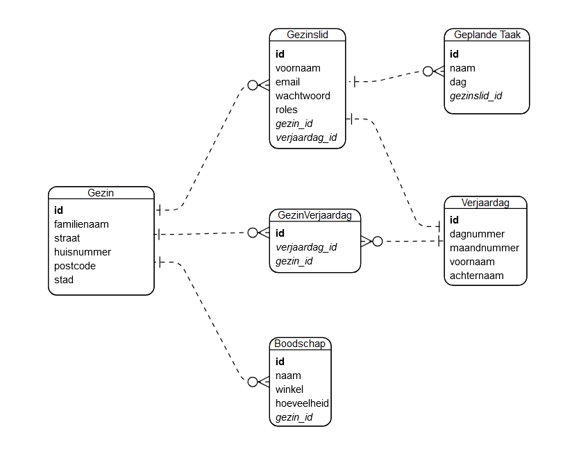

# Mikele Lemmens (202291269)

- [x] Web Services:
  - <https://github.com/Web-IV/2324-webservices-MikeleLemmens1.git>
  - <https://web-service-gezinsplanner-2023-2024.onrender.com>

**Logingegevens**

De onderstaande gegevens worden gebruikt om in te loggen als gezinslid in de app

- Gebruikersnaam/e-mailadres: <mikele.lemmens@hotmail.com>
- Wachtwoord: '12345678'
- Deze gebruiker is ook admin

## Projectbeschrijving

Deze toepassing werkt als gezinsplanner: gezinsleden kunnen zich registreren als gebruiker en zo een overzicht maken van welke huishoudelijke taken er aan wie zijn toegewezen. Er is ook een boodschappenlijst en verjaardagskalender beschikbaar. Als gebruiker maak je eerst een gezin aan, je hoeft niet te zijn geregistreerd om dit te kunnen doen. Vervolgens kan je jezelf registreren als gezinslid van dat gezin, om eventueel andere gezinsleden bij te voegen. Zodra je lid bent van een gezin kan je alle gegevens zien van het ganse gezin. Het is nl. nuttig om te zien welke taken de andere gezinsleden hebben toegewezen, en het is mogelijk deze te wijzigen.

## API calls

### Gezinsleden

- `GET /api/gezinsleden/`: Toont alle gezinsleden (inclusief gebruikers, enkel als admin)
- `GET /api/gezinsleden/:id`: Toont een gezinslid met een bepaald id als die tot hetzelfde gezin behoort
- `POST /api/gezinsleden/login`: Log in als gebruiker
- `POST /api/gezinsleden/register`: Registreer als gebruiker
- `POST /api/gezinsleden/`: Voeg een gezinslid toe aan je gezin als niet-gebruiker
- `PUT /api/gezinsleden/:id`: Pas een gezinslid aan (enkel als deze tot je eigen gezin behoort)
- `DELETE /api/gezinsleden/:id`: Verwijder een gezinslid/gebruiker van je eigen gezin

### Gezinnen

- `GET /api/gezinnen/`: Toont alle gezinnen, hier moet je geen admin voor zijn
- `GET /api/gezinnen/:id`: Toont een gezin indien je er lid van bent
- `GET /api/gezinnen/:id/gezinsleden`: Toont alle gezinsleden van een gezin (deze route toont meer details van de gezinsleden dan wanneer je het gezin opvraagt)
- `GET /api/gezinnen/:id/geplande_taken`: Toont alle geplande taken van een gezin. Een geplande taak behoort tot een gezinslid, deze route verzamelt alle geplande taken van alle gezinsleden
- `POST /api/gezinnen/`: Maak een nieuw gezin aan
- `PUT /api/gezinnen/:id`: Maak een nieuw gezin aan
- `DELETE /api/gezinnen/:id`: Verwijder een gezin

### Boodschappen

- `GET /api/gezinnen/:id/boodschappen/`: Toont alle boodschappen van je gezin
- `GET /api/gezinnen/:id/boodschappen/:boodschap_id`: Toont een boodschap van je gezin
- `POST /api/gezinnen/:id/boodschappen/`: Maakt een boodschap voor je gezin
- `PUT /api/gezinnen/:id/boodschappen/:boodschap_id`: Wijzigt een boodschap voor je gezin
- `DELETE /api/gezinnen/:id/boodschappen/:boodschap_id`: Verwijdert een boodschap voor je gezin

### GeplandeTaak

- `GET /api/gezinsleden/:id/geplande_taken/`: Toont alle geplande taken van een gezinslid van je gezin
- `GET /api/gezinsleden/:id/geplande_taken/:taak_id`: Toont een geplande taak van een gezinslid van je gezin
- `POST /api/gezinsleden/:id/geplande_taken/`: Maakt een geplande taak voor een lid van je gezin
- `PUT /api/gezinsleden/:id/geplande_taken/taak_id`: Wijzigt een geplande taak voor een lid van je gezin
- `DELETE /api/gezinsleden/:id/geplande_taken/taak_id`: Verwijdert een geplande taak voor een lid van je gezin

### Verjaardag

- `GET /api/gezinnen/:id/verjaardagen/`: Toont de verjaardagskalender van je gezin
- `GET /api/gezinnen/:id/verjaardagen/:verjaardag_id`: Toont een verjaardag van op de kalender van je gezin
- `POST /api/gezinnen/:id/verjaardagen/`: Maak een nieuwe verjaardag
- `PUT /api/gezinnen/:id/verjaardagen/:verjaardag_id`: Maak een nieuwe verjaardag
- `DELETE /api/gezinnen/:id/verjaardagen/:verjaardag_id`: Maak een nieuwe verjaardag

## Behaalde minimumvereisten

### Web Services

- **datalaag**

  - [x] voldoende complex (meer dan één tabel, 2 een-op-veel of veel-op-veel relaties)
  - [x] één module beheert de connectie + connectie wordt gesloten bij sluiten server
  - [x] heeft migraties - indien van toepassing
  - [x] heeft seeds

- **repositorylaag**

  - [x] definieert één repository per entiteit (niet voor tussentabellen) - indien van toepassing
  - [x] mapt OO-rijke data naar relationele tabellen en vice versa - indien van toepassing

- **servicelaag met een zekere complexiteit**

  - [x] bevat alle domeinlogica
  - [x] bevat geen SQL-queries of databank-gerelateerde code

- **REST-laag**

  - [x] meerdere routes met invoervalidatie
  - [x] degelijke foutboodschappen
  - [x] volgt de conventies van een RESTful API
  - [x] bevat geen domeinlogica
  - [x] geen API calls voor entiteiten die geen zin hebben zonder hun ouder (bvb tussentabellen)
  - [x] degelijke authorisatie/authenticatie op alle routes

- **algemeen**

  - [x] er is een minimum aan logging voorzien
  - [x] een aantal niet-triviale integratietesten (min. 1 controller >=80% coverage)
  - [x] minstens één extra technologie
  - [x] maakt gebruik van de laatste ES-features (async/await, object destructuring, spread operator...)
  - [x] duidelijke en volledige README.md
  - [x] volledig en tijdig ingediend dossier en voldoende commits

## Projectstructuur

Ik heb grotendeels de structuur overgenomen zoals in het voorbeeld getoond, met als uitzondering dat er geen repositorylaag is. Sequelize roept instanties op uit de databank in de datalaag. In de servicelaag wordt beschreven welke relaties er moeten worden getoond (met bijhorende attributen).

## Extra technologie

Ik heb gebruik gemaakt van een ORM, nl. Sequelize. Hierdoor is mijn repositorylaag overbodig, door in mijn datalaag modellen te definiëren kan ik meteen de juiste relaties leggen tussen de tabellen van mijn databank. Ook het migreren en seeden is uitgevoerd met Sequelize (-CLI).

## Testresultaten

Opmerkingen:

- Bij het testen krijg ik op een bepaald moment vaak een storing, er loopt iets mis bij het verkrijgen van de loginheader. Het probleem lijkt op willekeurige momenten voor te vallen, en doordat de volgorde van de tests niet altijd dezelfde is vind ik de oorzaak niet. Soms loopt het gewoon wel vlekkeloos, waardoor de oorzaak vermoedelijk niet in mijn logica zit. Ik vermoed dat de parallelle uitvoering problemen oplevert. Het verslag hierboven is van een geslaagde run, en geeft de werkelijke resultaten van de coverage.
- Er zijn nog een aantal lijnen die niet gecoverd zijn. Dit heeft te maken met mijn HandleDbError-file. Deze wordt eigenlijk nooit gebruikt omdat de fouten op andere plekken worden opgevangen en gegooid als service errors.

## Gekende bugs

Het testen verloopt niet vlekkeloos, de oorzaak heb ik niet kunnen achterhalen

## Wat is er verbeterd/aangepast?

Er is weinig waar ik niet aan heb gesleuteld. In eerste zit ben ik vastgelopen op de authenticatie/autorisatie, waardoor mijn testen ook niet meer werkten en ik de app niet meer live kreeg. Ik ben als het ware van de basis terug begonnen. Ik heb eerst goed gedefinieerd welke endpoints ik wel en niet wou gebruiken, om deze dan ook te nesten. Daarnaast heb ik bij het opvragen van instanties de relaties laten meegeven, als je bv. een gezin opvraagt krijg je de gezinsleden, boodschappen en verjaardagen mee terug.
Vervolgens heb ik extra aandacht besteed aan het goed begrijpen van de authenticatie/autorisatie. Dat lukte niet in eerste zit, ik heb toen deze code in een aparte branch gezet en weggegooid alvorens opnieuw te beginnen voor 2e zit. Ik heb nl. te veel gerommeld in mijn functies zonder te beseffen dat je credentials meegeeft in de context en dat je deze moet raadplegen. Ik heb een stap verder gezet dan de voorbeeldapplicatie en autorisatie gebaseerd op gezinsniveau ipv op gebruikersniveau (een gezinslid kan alles zien/doen van alle leden van hetzelfde gezin).
Omdat in eerste zit mijn testen niet meer werkten na het implementeren van auth heb ik deze stap pas erna gedaan, en ervoor gezorgd dat mijn testen werken inclusief auth. Hoewel er nog een bug aanwezig is slagen de testen en heb ik een vrij grote coverage. Het aantal testen is verhoogd van 100 naar 150.
Tot slot is de server live en bruikbaar, dat was in januari niet het geval. Ook kan ik zeggen dat ik nu tevreden ben over de kwaliteit van mijn eindresultaat, wat in schril contrast staat met de gebrekkige implementatie van mijn eerste versie.
