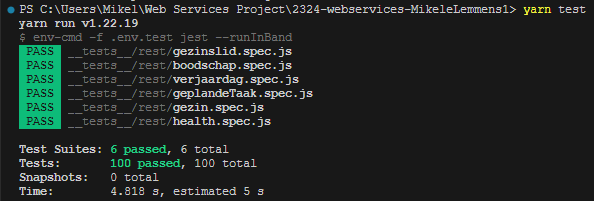

# Mikele Lemmens (202291269)

- [ ] Web Services: GITHUB URL
  - <https://github.com/Web-IV/2324-webservices-MikeleLemmens1.git>
  - <LINK_ONLINE_VERSIE_HIER>

**Logingegevens**

- Gebruikersnaam/e-mailadres: <mikele.lemmens@student.hogent.be>
- Wachtwoord:

> Vul eventueel aan met extra accounts voor administrators of andere rollen.

## Projectbeschrijving

 Een gezin moet met bijzonder veel zaken rekening houden. Iedere dag lijkt er een waslijst aan taken en herinneringen te zijn die snel overweldigend kunnen worden. Het bijhouden van zulke zaken in een gebruiksvriendelijk overzicht kan al een deel van het werk overnemen. Ik maak de API die kan worden gebruikt om dit mogelijk te maken.  

 Een **gezinsplanner** bestaat uit een **weekoverzicht** van de terugkerende taken. Er is ook een **boodschappenlijst**, **verjaardagskalender**, **agenda** en zelfs een lijstje met de todo's die niet dringend zijn (een **onderhoud**). Deze elementen hebben de volgende eigenschappen:  

- Het weekoverzicht is een verzameling van 7 dagen. Per dag wordt per **dagtaak** een gezinslid toegewezen. De dagtaken hebben een *naam*, krijgen een uitvoerder (**gezinslid**) en behoren toe tot een of meerdere **dagen**.
- Een agenda is een verzameling van allerlei **agendapunten**, dewelke elk een of meerdere dagen hebben. Een agendapunt heeft een *omschrijving*, een *frequentie*, een *start- en einddatum* en een *eigenaar*. Indien er geen eigenaar is toegewezen behoor het agendapunt toe aan het hele gezin.
- **Boodschappen** kunnen worden opgelijst, evt. per *winkel*. Een *naam* (of omschrijving) en een *hoeveelheid*.
- Een **verjaardagskalender** is een verzameling van **verjaardagen**. Een verjaardag heeft een *dag(index)*,*maand*, *geboortejaar*, en de *voornaam* en *familienaam* van de jarige.
- Een voorbeeld van een onderhoud is bv. het wassen van de ramen. Dat hoeft niet op een specifieke dag te gebeuren, maar je wil het je wel herinneren voor wanneer je tijd hebt voorzien om de taak uit te voeren. Een onderhoud heeft een *naam*, kan een *duur* meekrijgen (voor wanneer je bv. snel wil zien welke taken je kan doen wanneer je maar een half uur hebt), en heeft ook een *type* (schoonmaak, herstelling of varia). Een verzameling van onderhouden is de to-dolijst en deze worden niet toegewezen aan een gezinslid maar aan het **gezin**.

Verder volgt een ERD op basis van deze omschrijving. Omdat er veel onderdelen zijn die gelinkt worden aan een specifieke dag heb ik besloten er een aparte entiteit van te maken. Een **dag** heeft een *dagnaam*, *dagnummer*, *maandnummer*, *jaarnummer*. De **gezinsleden** hebben elke een *voornaam*, en kunnen uitvoerder/eigenaar zijn van dagtaken, agendapunten en hebben een verjaardag. Ik heb alle entiteiten die moeten worden opgeslagen voor lange tijd een id gegeven. Een onderhoud of boodschap heeft enkel betekenis totdat deze is uitgevoerd, dus ga ik geen extra id toevoegen. Deze worden geïdentificeerd op basis van de naam die wordt meegegeven. Ook bij verjaardagen is dat zo, al wordt een verjaardag geïdentificeerd op basis van de voor- en achternaam van de jarige.

#### Dien ik de gezinsleden als entiteiten te voorzien in mijn ERD, of beschouw ik dat beter als users die uit dit systeem blijven? (Maar dan bv. een gebruiker van de databank)

## API calls

> Maak hier een oplijsting van alle API cals in jouw applicatie. Groepeer dit per entiteit. Hieronder een voorbeeld.
>
> Indien je als extra Swagger koos, dan voeg je hier een link toe naar jouw online documentatie. Swagger geeft nl. exact (en nog veel meer) wat je hieronder moet schrijven.

### Gebruikers

- `GET /api/users`: alle gebruikers ophalen
- `GET /api/users/:id`: gebruiker met een bepaald id ophalen

## Behaalde minimumvereisten

> Duid per vak aan welke minimumvereisten je denkt behaald te hebben
>
### Web Services

- **datalaag**

  - [ ] voldoende complex (meer dan één tabel, 2 een-op-veel of veel-op-veel relaties)
  - [ ] één module beheert de connectie + connectie wordt gesloten bij sluiten server
  - [ ] heeft migraties - indien van toepassing
  - [ ] heeft seeds
 

- **repositorylaag**

  - [ ] definieert één repository per entiteit (niet voor tussentabellen) - indien van toepassing
  - [ ] mapt OO-rijke data naar relationele tabellen en vice versa - indien van toepassing
 

- **servicelaag met een zekere complexiteit**

  - [ ] bevat alle domeinlogica
  - [ ] bevat geen SQL-queries of databank-gerelateerde code
 

- **REST-laag**

  - [ ] meerdere routes met invoervalidatie
  - [ ] degelijke foutboodschappen
  - [ ] volgt de conventies van een RESTful API
  - [ ] bevat geen domeinlogica
  - [ ] geen API calls voor entiteiten die geen zin hebben zonder hun ouder (bvb tussentabellen)
  - [ ] degelijke authorisatie/authenticatie op alle routes
 

- **algemeen**

  - [ ] er is een minimum aan logging voorzien
  - [ ] een aantal niet-triviale integratietesten (min. 1 controller >=80% coverage)
  - [ ] minstens één extra technologie
  - [ ] maakt gebruik van de laatste ES-features (async/await, object destructuring, spread operator...)
  - [ ] duidelijke en volledige README.md
  - [ ] volledig en tijdig ingediend dossier en voldoende commits

## Projectstructuur

### Web Services

> Hoe heb je jouw applicatie gestructureerd (mappen, design patterns...)?

## Extra technologie

### Web Services

> Wat is de extra technologie? Hoe werkt het? Voeg een link naar het npm package toe!

## Testresultaten

### Web Services

> Schrijf hier een korte oplijsting en beschrijving van de geschreven testen + voeg een screenshot van de coverage en uitvoering toe

## Gekende bugs

### Web Services

> Zijn er gekende bugs?
